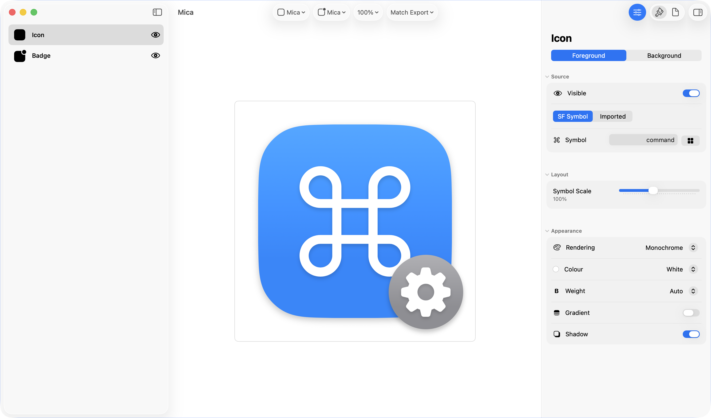
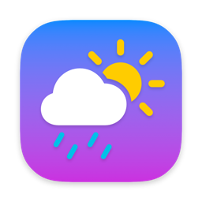
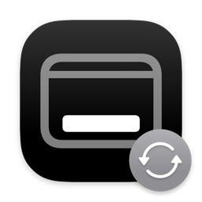

# Mica

*Add some sparkle to your self-service portal*



## Table of Contents

- [About](#about)
- [Features](#features)
- [Requirements](#requirements)
- [Installation](#installation)
  - [Uninstalling](#uninstalling)
- [Quick Start](#quick-start)
- [Usage](#usage)
  - [App](#app)
  - [CLI](#cli)
- [Documentation](#documentation)
- [Getting Help](#getting-help)
- [Contributing](#contributing)
- [Changelog](#changelog)
- [License](#license)
- [Acknowledgements](#acknowledgements)

## About

Mica (Mac-admin Icon Creation App) is an app for Mac Admins to create icons for self service catalogues, user facing scripts and workflows, and anywhere else you can find a use for them.

It pairs customisable SwiftUI elements with SF Symbols or imported graphics to enable you to quickly create visually consistent icons that look native on Apple platforms.

(I know you don't hyphenate Mac Admin but I had to make the acronym work.)

  |  |   |  |  |  |  | 
|---|---|---|---|---|---|---|

*These were all created with Mica, it would be weird to put them here if they weren't.*

## Features

- **Icons from SF Symbols** - pick any SF Symbol and put in a squircle, with many SwiftUI styling options to choose from. SF Symbols are not consistent in size, visual alignment, or built-in padding, so I hand aligned and resized 7000+ SF Symbols for improved visual consistency.

- **Icons from your own images** - Don’t like SF Symbols or have a custom one you want to use? No worries, you can swap out the SF Symbol for any custom graphic.

- **Extract app icons** - Need to grab an app icon? Just drag and drop it in. Did the developer neglect to add padding and shadow to the icon and now you have a big flat abomination marring the beauty of your self service catalogue? Well now you can add them back with two clicks. Also, you can extract icons with the bundled CLI tool, point it at an app to grab its icon or point it at `/Applications` to grab every icon, perfect for when you need to update your catalogue every time Apple redesigns them.

- **Extract file icons** - Extracting icons isn’t limited to apps. Import any file type to extract its icon. Image file types import the image themselves.

- **Badges** - overlay a second, smaller icon in any corner. Great for maintenance, repair, or uninstall scripts.

- **Liquid Glass Icons** - System Mode renders through macOS's own icon rendering pipeline. This enables you to create icons with Liquid Glass effects on macOS 26+.

- **Self Service Previews** - Preview your icon at the exact sizes in common MDM portals so you know it looks right in the context of how your users will see it. If yours is missing, let me know the size it displays at and I'll add it.

- **CLI** - A companion command-line tool (`mica-cli`) produces identical output to the app, so you can script icon generation in CI or batch workflows. It can also extract existing icons from apps and files on disk.

- **JSON Import/Export** - Everything else is becoming delcarative and now your icons can too. Save your design as JSON to reuse later in the app or with `mica-cli`.


## Requirements

- **macOS 15 Sequoia or later.**
- Some features rely on newer APIs and require **macOS 26 Tahoe or later**: System generation mode (Liquid Glass icons) and gradient SF symbol rendering. Everything else works on macOS 15.

## Installation

Download the latest `.pkg` or `.dmg` from [Releases](../../releases).

The `.pkg` installs `Mica.app` and symlinks `/Applications/Mica.app/Contents/MacOS/mica-cli` to `/usr/local/bin/mica-cli` so the CLI is on your `PATH`.

If you don't want the symlink, download the `.dmg` instead and copy `Mica.app` to `/Applications`.

If you installed from the `.dmg` and do want the CLI on your `PATH`, run:

```shell
sudo ln -s /Applications/Mica.app/Contents/MacOS/mica-cli /usr/local/bin/mica-cli
```

Other installation methods coming soon.

### Uninstalling

```shell
# CLI symlink (pkg installs only)
sudo rm /usr/local/bin/mica-cli
# app
rm -rf /Applications/Mica.app
# settings and app data
rm -rf ~/Library/Containers/com.lukecharters.Mica
```

## Usage

### App

<!-- SCREENSHOT PLACEHOLDER — annotated window
Replace with a screenshot of the window with the sidebar, preview, and
inspector visible (ideally annotated with the step numbers below).

-->

1. **Pick a symbol.** Open the symbol browser and choose an SF Symbol, or switch the icon source to *Imported* and drag in your own artwork.

2. **Style the layers.** The sidebar is organised by layer - select the icon's background or foreground to adjust colours, gradients, rendering mode, symbol weight, scale, and shadows. Backgrounds can be a solid colour, a gradient, or an imported image.

3. **Add a badge (optional).** Turn on the badge layer to overlay a second symbol or image in any corner. Drag the badge directly on the preview to fine-tune its position, or use the offset sliders.

4. **Preview at real-world sizes.** Use the preview size menu to see your icon exactly as it will appear in Jamf Self Service / Self Service+ catalogue and item views, or at any standard icon size from 16 px to 1024 px. Zoom from 25% to 800% to inspect details.

5. **Export.** Press **⌘E**, choose a size (16–1024 px), optionally enable @2x output, pick sRGB or Display P3, and save your PNG.

**System mode:** switch the generation mode from *Mica* to *System* to have macOS itself render the icon, using Apple's own symbol sizing and layout. Pick the symbol and background colours from Apple's named palette, or supply any custom colour. Use this when you want output indistinguishable from native system icons, including Liquid Glass effects on macOS 26+.

Every control is documented in the [App Guide](../../wiki/App-Guide).

### CLI

`mica-cli` shares its rendering engine with the app - same settings, same pixels. The essentials are below; the wiki has a full [CLI Guide](../../wiki/CLI-Guide) and a complete [CLI Reference](../../wiki/CLI-Reference) covering every flag.

#### Generating icons

```shell
# A symbol on the default blue gradient, saved as star.fill.png
mica-cli --icon-symbol star.fill

# Choose output path, size, and background colour
mica-cli --icon-symbol folder.fill -o ~/Desktop/folder-icon.png --size 512 --icon-bg-color red

# Symbol styling
mica-cli --icon-symbol shield.fill --icon-symbol-rendering hierarchical --icon-symbol-color white

# Custom two-colour gradient background
mica-cli --icon-symbol app.fill --icon-bg custom-gradient --icon-bg-gradient-colors "#FF6B35,#F7931E"

# macOS 15 squircle, flat colour
mica-cli --icon-symbol star.fill --icon-bg-corner-radius macos15 --icon-bg-gradient off

# Add a badge (--badge-fg, --badge-bg or --badge-visibility on turns it on)
mica-cli --icon-symbol star.fill --badge-symbol plus.circle --badge-position bottom-right

# Badge artwork with no symbol over it
mica-cli --icon-symbol star.fill --badge-bg ~/badge-art.png

# Use your own image instead of an SF Symbol
mica-cli --icon-fg ~/logo.png

# System mode: macOS renders the icon (Liquid Glass on macOS 26+)
mica-cli --icon-symbol star.fill --icon-generation-mode system --icon-bg-color blue --icon-symbol-color white

# High-resolution export
mica-cli --icon-symbol app.fill --size 1024 --scale 2x --color-space displayP3
```

Colours can be named (`blue`, `grey`, `primary`, …), hex (`"#FF6B35"`), `rgb()`/`hsl()` values, or components in a named colour space (`srgb:0.2,0.42,0.9`, `display-p3:1,0.2,0`). Every `--…-color` flag has a `--…-colour` alias. See [Colour Formats](../../wiki/Colour-Formats).

For scripting, the saved path goes to stdout and diagnostics go to stderr, so `mica-cli` pipes cleanly:

```shell
mica-cli --icon-symbol star.fill --json      # machine-readable result on stdout
mica-cli --icon-symbol star.fill --quiet     # only the saved path on stdout
mica-cli --icon-symbol star.fill --verbose   # per-phase progress on stderr
```

#### Extracting existing icons
The `extract` subcommand exports the icon of any app, file, or folder as a PNG:

```shell
# Export an icon to the working directory
mica-cli extract /Applications/Safari.app

# Export every icon in /Applications at 512 px @2x
mica-cli extract /Applications -o ~/Desktop/icons --recursive --size 512 --scale 2x

# Chaos option. Don't actually run this.
mica-cli extract / -o ~/Desktop/icons --recursive --depth 999
```

## Documentation
Detailed documentation lives in the [wiki](../../wiki):

- [Getting Started](../../wiki/Getting-Started) — install, first icon, first extraction
- [App Guide](../../wiki/App-Guide) — every control in the app, explained
- [CLI Guide](../../wiki/CLI-Guide) — task-oriented CLI usage with examples
- [CLI Reference](../../wiki/CLI-Reference) — every command and flag
- [Extracting Icons](../../wiki/Extracting-Icons) — single and bulk extraction
- [Colour Formats](../../wiki/Colour-Formats) — every way to specify a colour

## Getting Help
Found a bug or have a question/feature request? [Open an issue](../../issues).

For bugs, please include your macOS version, app version, and what you did to break it.

## Contributing
Contributions are welcome, please open an issue or discussion first though. See [CONTRIBUTING.md](./CONTRIBUTING.md) for how to build from source and run the tests.

## License
Distributed under the [Apache License, Version 2.0](./LICENSE).


## Acknowledgements
- [Trevor Sysock/BigMacAdmin](https://github.com/bigmacadmin) for putting me onto [Pico Mitchell's](https://github.com/PicoMitchell) icon generation [discoveries](https://bigmacadmin.wordpress.com/2023/06/02/fun-with-app-icons/).
- [Pico Mitchell](https://github.com/PicoMitchell) for the above.
- [Trevor Sysock/BigMacAdmin](https://github.com/bigmacadmin) again for starting me down the path of automated icon extraction with [IconGrabber.sh](https://bigmacadmin.wordpress.com/2024/05/30/icongrabber-sh-find-and-convert-icns-to-png-easily-mac-admins-utility/)
- Apple's [SF Symbols](https://developer.apple.com/sf-symbols/).
SF Symbols are subject to [Apple's licensing terms](https://developer.apple.com/support/terms/).

## Alternatives
Mac Admins are awesome and love creating free tools for the community. If Mica doesn't fit your needs them here are some alternative icon tools.
- SAP's [Icons](https://github.com/SAP/macOS-icon-generator)
- Kitzy's [Icon Grabber](https://github.com/macadmins/icongrabber)
- Adam Anklewicz's [SFIcons](https://github.com/aanklewicz/SFIcons)