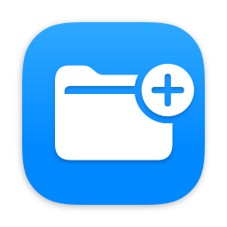
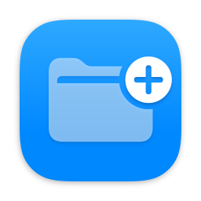
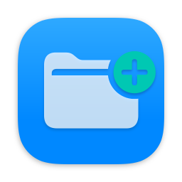
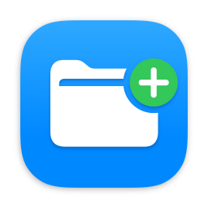
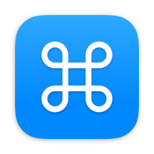
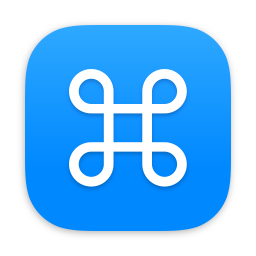
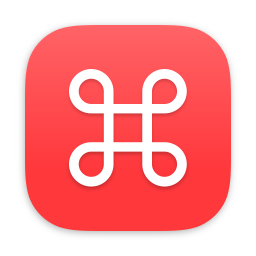
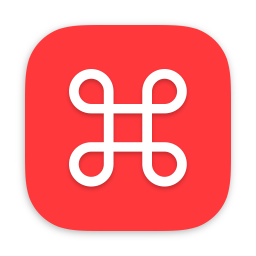

# App Guide

Every control in the Mica app, explained. The CLI exposes the same options — each section links to the matching flags in the [CLI Reference](CLI-Reference).

## The window

<!-- SCREENSHOT PLACEHOLDER — annotated window regions

-->

Mica's window has three regions:

- **Layer sidebar** (left) — selects which layer you're editing: the Icon or Badge group, or their Foreground/Background layers.
- **Preview** (centre) — a live preview of the icon. Some interactions happen directly here (badge dragging, drag-and-drop import).
- **Inspector** (right) — the controls for whatever is selected in the sidebar, with two tabs: **Controls** (styling) and **Export**.

Both side panels are resizable, and the toolbar buttons show/hide the inspector.

## The layer sidebar

The sidebar lists two groups — **Icon** and **Badge** — each containing a **Foreground** and a **Background** layer (in Mica mode).

- Select a row to edit it in the inspector. Selecting a group header shows group-level controls (generation mode, and badge layout for the Badge group).
- Every row has an **eye toggle** to show or hide that layer. The group header's eye is tri-state: it shows a half-closed eye when some layers are hidden, and clicking it shows or hides the whole group.
- The **badge is hidden by default** — click its eye (or select the Badge group and reveal it) to turn it on. In the CLI, any of `--badge-fg`, `--badge-bg` or `--badge-visibility on` activates the badge.

## Generation modes: Mica vs System

At the top of each group's inspector is the **Generation Mode** picker. The Icon and Badge groups have independent modes — a Mica icon can carry a System badge and vice versa.

| | **Mica** | **System** |
|---|---|---|
| Rendered by | Mica's own SwiftUI pipeline | macOS's icon-rendering pipeline (the same one that draws system icons) |
| Layers | Foreground + Background, fully stylable | One symbol + one background colour; Apple handles sizing and layout |
| Liquid Glass | Pre-rendered material backgrounds | Real Liquid Glass on macOS 26+ |
| Sources | SF Symbols or imported images | SF Symbols only |
| Use when | You want control | You want output indistinguishable from native system icons |

In System mode the inspector shows just a symbol name field and two colour pickers — **Symbol Color** and **Background Color** — offering Apple's named palette plus **Custom…** for any colour. CLI: [`--icon-generation-mode` / `--badge-generation-mode`](CLI-Reference#generation).

## Icon Foreground

### Source

Choose **SF Symbol** or **Imported**.

- **SF Symbol** — type a symbol name, or click the grid button to open the searchable **SF Symbols browser**.
- **Imported** — click **Choose File…** (or drag, paste, or use the File menu) to use your own image. Dropping an app or non-image file imports its Finder icon instead. CLI: [`--icon-fg`](CLI-Reference#icon-foreground).

### Layout

- **Symbol Scale / Image Scale** (30%–200%) — resizes the foreground. Symbols are pre-calibrated for visual consistency, so you rarely need this; it's there for taste. CLI: `--icon-fg-scale`.

### Appearance

This whole pane appears only with **Show Advanced Controls** on (bottom of the inspector) — see [Show Advanced Controls](#show-advanced-controls) for what the simple pane shows instead.

| Control | What it does | CLI |
|---|---|---|
| **Rendering** | SF Symbol rendering mode: Monochrome, Hierarchical, Palette, or Multicolor. | `--icon-symbol-rendering` |
| **Color** | Symbol tint (Monochrome/Hierarchical/Multicolor). Preset dropdown or **Custom…** colour well. | `--icon-symbol-color` |
| **Primary / Secondary / Tertiary** | The three Palette-mode colours. | `--icon-symbol-palette` |
| **Weight** | Symbol weight from Ultralight to Black. **Auto** uses Mica's per-symbol calibration. | `--icon-symbol-weight` |
| **Gradient** *(macOS 26+)* | Gradient fill on the symbol colour. | `--icon-symbol-gradient` |
| **Shadow** | Drop shadow behind the symbol (or imported image). | `--icon-fg-shadow` |

Rendering modes compared (`folder.fill.badge.plus`):

| Monochrome | Hierarchical | Palette | Multicolor |
|---|---|---|---|
|  |  |  |  |

Weights compared (`star`):

| Ultralight | Regular | Black |
|---|---|---|
|  |  |  |

## Icon Background

### Source

**Type** picker: **Standard**, **Pre-Rendered**, or **Imported**.

- **Standard** — a solid colour or generated gradient chiclet.
- **Pre-Rendered** — a Liquid Glass material asset in one of 18 colours. This is how you get the Liquid Glass look without System mode.
- **Imported** — your own image, or an extracted app icon. CLI: [`--icon-bg`](CLI-Reference#icon-background).

### Layout (Imported only)

- **Icon Padding** — keep the native macOS icon padding and shadow that's baked into extracted icons, or turn it off to scale the image up and fill the frame. CLI: `--icon-bg-padding`.
- **Image Scale** (30%–200%). CLI: `--icon-bg-scale`.

### Appearance

| Control | What it does | CLI |
|---|---|---|
| **Corners** *(advanced)* | Chiclet silhouette: **macOS 11-15** (smaller radius) or **macOS 26** (squircle). | `--icon-bg-corner-radius` |
| **Color** | The background colour (Standard) or the pre-rendered asset colour (Pre-Rendered). | `--icon-bg-color` |
| **Gradient** *(advanced)* | Derive a top-to-bottom gradient from the colour; off gives a flat fill. | `--icon-bg-gradient` |
| **Custom Gradient** *(advanced)* | Pick your own two gradient stops (Primary/Secondary). | `--icon-bg custom-gradient --icon-bg-gradient-colors` |
| **Shadow** | Background drop shadow. With advanced controls on you can pick the **Off / macOS 11-15 / macOS 26** shadow styles. | `--icon-bg-shadow` |

| Corners: macOS 11-15 | Corners: macOS 26 | Gradient on | Gradient off | Custom gradient | Pre-rendered Liquid Glass |
|---|---|---|---|---|---|
|  |  |  |  |  |  |

## Badge

The badge is a second, smaller icon overlaid on a corner — great for marking maintenance, repair, or uninstall variants of the same icon.

### Badge Layout (on the Badge group)

| Control | What it does | CLI |
|---|---|---|
| **Position** | Anchor corner: Top/Bottom Left/Right. Changing it resets the manual offset. | `--badge-position` |
| **X / Y Offset** (−100%–100%) | Fine positioning from the anchor. You can also just **drag the badge on the preview**. | `--badge-offset-x/-y` |
| **Size** (30%–200%) | Overall badge scale. | `--badge-scale` |

| Top left | Top right | Bottom left | Bottom right |
|---|---|---|---|
|  |  |  |  |

### Badge Foreground and Background

The badge's Foreground and Background layers mirror the icon's controls: symbol or imported image, rendering mode, colours, weight, gradient, and shadows — see the sections above. Differences:

- The badge background is a **circle** (Standard colour/gradient, custom gradient, or imported image — no Liquid Glass option).
- The default badge background colour is **Gray**.

*A folder icon with a gear badge on a custom red–orange gradient: `mica-cli folder.fill --badge-fg symbol:gearshape.fill --badge-bg custom-gradient --badge-bg-gradient-colors "red,orange"`*

## Previewing

- **Preview size menu** (toolbar) — render the preview at any standard icon size (16–1024 pt), at your export size, or at MDM portal sizes:
  - Jamf Self Service+ — Catalog View (40 pt) and Item View (88 pt)
  - Jamf Self Service classic — Catalog View (75 pt) and Item View (120 pt)
- **Zoom menu** (toolbar) — 25% to 800%, or **Fit**.

Previewing at the real portal size is the quickest way to check that a fine symbol still reads clearly at 40 pt.

## Importing

Ways to get your own artwork (or another app's icon) into any of the four image slots (icon/badge × foreground/background):

- **Choose File…** in the relevant Source section.
- **Drag and drop** onto the preview (imports as the icon background).
- **File menu** — Import as Icon Background/Icon Symbol/Badge Background/Badge Symbol.
- **Edit menu / paste** — Paste as Icon Background (⇧⌘V), Icon Symbol (⇧⌘I), Badge Background (⇧⌘B), Badge Symbol (⇧⌘G).

Images are decoded and centred on a square transparent canvas (downscaled to at most 1024 px, never upscaled). PDFs and EPS files are rendered as vectors. Apps and other non-image files import their **Finder icon** — see [Extracting Icons](Extracting-Icons).

## Exporting

Switch the inspector to the **Export** tab (or just press **⌘E**):

| Control | Values | Default |
|---|---|---|
| **Size** | 16, 32, 64, 128, 256, 512, 1024 pt | 512 |
| **2x (Retina)** | on/off — doubles the pixel dimensions | off |
| **Color Space** | sRGB or Display P3 | sRGB |

**Export** (⌘E) saves a PNG. The suggested filename is the symbol name (or imported file's name) with a `-mica` suffix.

## Show Advanced Controls

The toggle at the bottom of the Controls tab. It switches the whole shape of the inspector, and the setting persists between launches.

**Off (the default)** — each group collapses to a single pane with the same shape as System mode, plus the shadows Mica renders itself:

| Section | Controls |
|---|---|
| **Source** | Visible, Symbol |
| **Appearance** | Symbol Color, Symbol Shadow, Background Color, Background Shadow |

The Badge group keeps its **Badge Layout** section (position, offsets, size) below those, exactly as the System badge pane does. There are no layer tabs, so clicking anywhere in the preview selects the whole group and the selection outline traces it.

**On** — reveals the Foreground / Background layer tabs and every per-layer control: the Source type pickers and imported-image controls, the Layout sections, the Rendering and Weight pickers, Gradient and Custom Gradient toggles, the Corners picker, and the multi-style Shadow picker.

Switching **off** folds each layer back to something the simple pane can show: an SF Symbol foreground on a plain colour background, monochrome rendering, one background colour. Nothing is thrown away — your imported artwork, palette colours and custom gradient colours all stay put, so switching back on and re-picking the source restores the previous look.

Importing an image while the advanced controls are off (**File ▸ Import as…**, **⇧⌘I** and friends, or dropping a file on the canvas) switches them on for you, since the simple pane has no controls for an imported layer.
