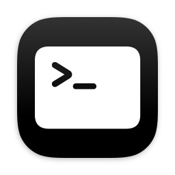

# CLI Guide

`mica-cli` is the command-line companion to the Mica app. It shares the app's rendering engine, so the same settings produce pixel-identical output — design an icon in the app, then reproduce and batch it in scripts or CI.

This page is task-oriented; every flag is catalogued in the [CLI Reference](CLI-Reference).

## Basics

```shell
# An SF Symbol on the default blue gradient, saved as star.fill.png
mica-cli --icon-symbol star.fill

# Choose the output path and size
mica-cli --icon-symbol star.fill -o ~/Desktop/star.png --size 1024

# See everything
mica-cli --help
```

`--icon-symbol` takes an SF Symbol name, with no `symbol:` prefix. Flags are namespaced by layer: `--icon-fg…`, `--icon-bg…`, `--badge-fg…`, `--badge-bg…` — the same four layers you see in the app's sidebar. `--icon-symbol` and `--badge-symbol` are shorthand for `--icon-fg symbol:<name>` and `--badge-fg symbol:<name>`; reach for the longer form when the layer is an image file.

> **Spelling:** both English spellings work — every `--…-color` flag has a `--…-colour` alias, `grey` works wherever `gray` does, and `multicolour` is accepted for `multicolor`.

## Styling the icon

```shell
# Background colour (flat or gradient)
mica-cli --icon-symbol terminal.fill --icon-bg-color black
mica-cli --icon-symbol command --icon-bg-colour red --icon-bg-gradient off

# Custom two-colour gradient
mica-cli --icon-symbol paintbrush.fill --icon-bg custom-gradient --icon-bg-gradient-colors "#FF6B35,#F7931E"

# Classic macOS 15 chiclet
mica-cli --icon-symbol gear --icon-bg-corner-radius macos15

# Symbol rendering, colour, and weight
mica-cli --icon-symbol shield.lefthalf.filled --icon-symbol-rendering hierarchical --icon-bg-color teal
mica-cli --icon-symbol gear --icon-symbol-rendering palette --icon-symbol-palette "mint,white:0.75,white:0.4"
mica-cli --icon-symbol star --icon-symbol-weight black

# Two-stop custom gradient
mica-cli --icon-symbol star.fill --icon-bg custom-gradient --icon-bg-gradient-colors teal,indigo
```

| `terminal.fill` on black | Hierarchical on teal | Custom gradient |
|---|---|---|
|  |  |  |

Colour values can be names, hex, `rgb()`/`hsl()`, or components in a named space (`srgb:`, `display-p3:`) — see [Colour Formats](Colour-Formats).

## System (Apple) generation mode

Let macOS itself render the icon, with Apple's own sizing, layout, and (on macOS 26+) Liquid Glass:

```shell
mica-cli --icon-symbol star.fill --icon-generation-mode system --icon-bg-color blue --icon-symbol-color white
```


In System mode the colour flags accept Apple's named tokens for the curated system look, or any custom colour (hex, `srgb:`, …) for an exact match to your branding. The colour flags are optional — omitting them gives the default white symbol on a blue enclosure.

Note that macOS renders the icon in the Mac's current appearance, so on a Mac in dark mode the output is the dark variant (dark enclosure, tinted symbol).

## Badges

Any of `--badge-fg`, `--badge-bg` or `--badge-visibility on` activates the badge — an argument
that says what the badge *is*, or asks for one directly. Position, scale, offsets and the
appearance flags describe a badge rather than ask for one, so they do nothing on their own:

```shell
# A plus badge in the default bottom-right corner
mica-cli --icon-symbol star.fill --badge-symbol plus.circle.fill

# Position, size, and fine offset
mica-cli --icon-symbol star.fill --badge-symbol trash.fill --badge-position top-right --badge-scale 1.2

# Attach a negative offset with =, or -0.05 is read as another flag
mica-cli --icon-symbol star.fill --badge-symbol gear --badge-offset-x 0.1 --badge-offset-y=-0.05

# Styled badge background
mica-cli --icon-symbol folder.fill --badge-symbol gearshape.fill \
  --badge-bg custom-gradient --badge-bg-gradient-colors "red,orange"
```


A common admin pattern — one base icon, badge variants for install/uninstall/repair:

```shell
for variant in "plus.circle.fill:install" "minus.circle.fill:uninstall" "wrench.fill:repair"; do
  symbol="${variant%%:*}"; name="${variant##*:}"
  mica-cli --icon-fg ~/firefox-logo.png \
    --badge-fg "symbol:$symbol" -o "icons/firefox-$name.png"
done
```

## Using your own images

Any of the four layers can be an image file instead of a symbol or generated background:

```shell
# Your logo as the foreground
mica-cli --icon-fg ~/logo.png

# An image background behind a symbol
mica-cli --icon-symbol star.fill --icon-bg ~/bg.png --icon-bg-scale 0.9

# An extracted app icon as the background, with native padding kept
mica-cli extract "/Applications/Company Portal.app" -o /tmp
mica-cli --icon-bg "/tmp/Company Portal.png" --icon-bg-padding on
```

An imported background needs no symbol behind it: it hides the foreground by default, on the assumption the artwork is a finished icon. Naming a foreground brings it back — `--icon-symbol`, or any other `--icon-fg…`/`--icon-symbol-…` flag — and `--icon-fg-visibility on` forces it whatever else you passed.

## Export options

```shell
mica-cli --icon-symbol app.fill --size 1024 --scale 2x --color-space displayP3
```

`--size` is 16–1024 pixels; `--scale 2x` doubles the output pixels; the colour space defaults to sRGB (the right choice for most MDM portals).

## Scripting

The saved file path goes to **stdout**; everything else goes to **stderr**. That means `mica-cli` composes cleanly with pipes, `$(…)`, and `xargs`:

```shell
icon=$(mica-cli --icon-symbol star.fill --quiet)
echo "Saved to $icon"
```

Output modes:

```shell
mica-cli --icon-symbol star.fill --json      # a single JSON result object on stdout
mica-cli --icon-symbol star.fill --quiet     # only the path on stdout, errors on stderr
mica-cli --icon-symbol star.fill --verbose   # per-phase progress on stderr
```

Batch generation is just a loop:

```shell
while IFS=, read -r symbol colour; do
  mica-cli "$symbol" --icon-bg-color "$colour" -o "icons/$symbol.png" --quiet
done <<'EOF'
star.fill,blue
wrench.fill,orange
trash.fill,red
EOF
```

Exit codes are non-zero on failure, and `--json` emits an error object instead of a result, so CI can rely on either.

## Extracting icons

The `extract` subcommand exports the icon of any app, file, or folder — including bulk extraction of a whole directory. It has its own page: [Extracting Icons](Extracting-Icons).
