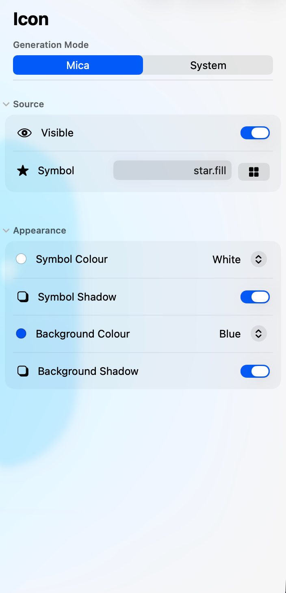
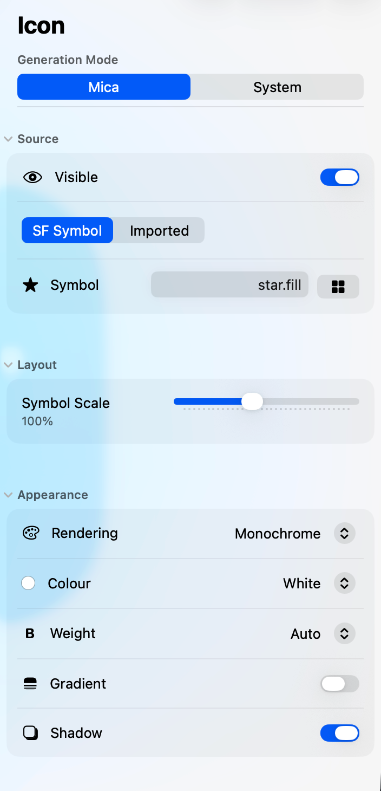
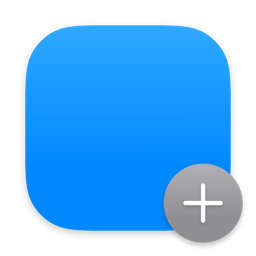
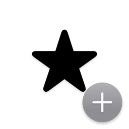
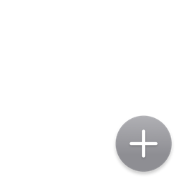
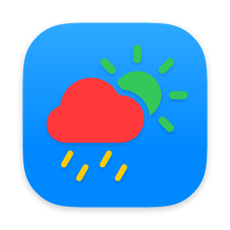
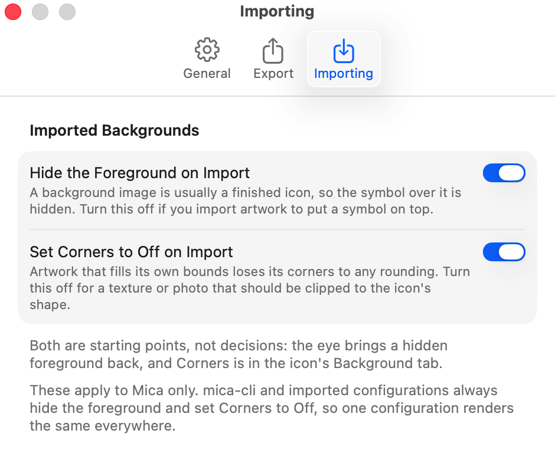

# Icon Settings

This page lists every setting for the main icon.
Use [Settings Index](Settings-Index) to find a setting by name or flag.

## When controls appear

Advanced controls are off by default.
The simple pane shows six controls while your other settings still apply.
Turning advanced controls off folds away imported images, palettes, and custom gradients.
Mica keeps the artwork and colours under those settings.
Importing an image turns advanced controls back on.

| Gate | Default | Effect |
|---|---|---|
| **Show Advanced Controls** | Off | On shows separate Foreground and Background layers. |
| **Generation Mode** | Mica | System shows one pane and ignores most Mica settings. |
| **Foreground Source** | SF Symbol | Imported shows image controls instead of symbol controls. |
| **Rendering** | Monochrome | Palette shows three colour controls. |
| **Background Type** | Colour | Imported shows image layout controls. |
| **Custom Gradient** | Off | On shows two gradient colour controls. |
| **macOS 26** | Not applicable | System mode and symbol gradients need macOS 26. |

 

Left: advanced controls off. Right: advanced controls on, editing the Foreground layer.

Each eye in the sidebar shows or hides one layer.


The icon background is hidden here, so the Icon eye is mixed.

## Visibility examples

   

From left: both layers visible, foreground hidden, background hidden, whole icon hidden.

## Whole icon

### Generation Mode

Chooses whether Mica or macOS draws the icon.

| | |
|---|---|
| **In the app** | Icon ▸ **Generation Mode** |
| **Command line** | `--icon-generation-mode mica\|system` |
| **Config key** | `"icon-generation-mode"` |
| **Default** | `mica` |
| **Shown when** | Always shown. System needs macOS 26. |

```shell
mica-cli --icon-symbol star.fill --icon-generation-mode mica
```

### Icon Visibility

Shows or hides both icon layers.

| | |
|---|---|
| **In the app** | Sidebar ▸ Icon eye |
| **Command line** | `--icon-visibility on\|off` |
| **Config key** | `"icon-visibility"` |
| **Default** | `on` |
| **Shown when** | Always shown. |

```shell
mica-cli --icon-symbol star.fill --badge-symbol plus --icon-visibility off
```

## Foreground

The foreground contains an SF Symbol or an imported image.

### Foreground Source

Chooses an SF Symbol or an imported image for the foreground.

| | |
|---|---|
| **In the app** | Icon ▸ Foreground ▸ Source ▸ **Source** and symbol or image picker |
| **Command line** | `--icon-symbol NAME`, `--icon-fg symbol:NAME`, or `--icon-fg PATH` |
| **Config key** | `"icon-fg"` |
| **Default** | `symbol:command` |
| **Shown when** | Mica mode. System mode accepts SF Symbols only. |

 

Left: SF Symbol. Right: imported image.

```shell
mica-cli --icon-fg logo.png --size 256
```

Do not use the `symbol:` prefix with `--icon-symbol`.
Giving both foreground flags is an error.

### Foreground Visibility

Shows or hides the icon foreground.

| | |
|---|---|
| **In the app** | Sidebar ▸ Icon ▸ Foreground eye or Icon ▸ Foreground ▸ Source ▸ **Visible** |
| **Command line** | `--icon-fg-visibility on\|off` |
| **Config key** | `"icon-fg-visibility"` |
| **Default** | `on` |
| **Shown when** | Advanced controls are on and Mica mode is active. |

```shell
mica-cli --icon-symbol star.fill --icon-fg-visibility off
```

> **System mode ignores this layer setting.**

### Foreground Scale

Changes the size of the symbol or image inside the icon.

| | |
|---|---|
| **In the app** | Icon ▸ Foreground ▸ Layout ▸ **Symbol Scale** or **Image Scale** |
| **Command line** | `--icon-fg-scale 0.3...2.0` |
| **Config key** | `"icon-fg-scale"` |
| **Default** | `1.0` |
| **Shown when** | Advanced controls are on and Mica mode is active. |

  

From left: `0.5`, `1.0`, `1.5`.

```shell
mica-cli --icon-symbol star.fill --size 256 --icon-fg-scale 1.5
```

> **System mode ignores this.**

### Symbol Rendering

Chooses how an SF Symbol uses colour across its layers.

| | |
|---|---|
| **In the app** | Icon ▸ Foreground ▸ Appearance ▸ **Rendering** |
| **Command line** | `--icon-symbol-rendering monochrome\|hierarchical\|multicolor\|palette` |
| **Config key** | `"icon-symbol-rendering"` |
| **Default** | `monochrome` |
| **Shown when** | Advanced controls are on, Mica mode is active, and the foreground source is SF Symbol. |

   

From left: `monochrome`, `hierarchical`, `multicolor`, `palette`.
Hierarchical may match monochrome on a single-layer symbol.

```shell
mica-cli --icon-symbol cloud.sun.rain.fill --size 256 --icon-symbol-rendering palette
```

> **System mode ignores this.**

### Symbol Colour

Sets the symbol colour outside palette mode.

| | |
|---|---|
| **In the app** | Icon ▸ Foreground ▸ Appearance ▸ **Color** |
| **Command line** | `--icon-symbol-color COLOR` |
| **Config key** | `"icon-symbol-color"` |
| **Default** | `white` |
| **Shown when** | The foreground source is SF Symbol and Rendering is not Palette. |

  

From left: `white`, `black`, `yellow`.

```shell
mica-cli --icon-symbol star.fill --size 256 --icon-symbol-color yellow
```

See [Colour Formats](Colour-Formats) for accepted values.

### Symbol Palette

Sets the primary, secondary, and tertiary colours for palette rendering.

| | |
|---|---|
| **In the app** | Icon ▸ Foreground ▸ Appearance ▸ **Primary**, **Secondary**, and **Tertiary** |
| **Command line** | `--icon-symbol-palette COLOR,COLOR,COLOR` |
| **Config key** | `"icon-symbol-palette"` |
| **Default** | `white,green,yellow` |
| **Shown when** | Advanced controls are on, Mica mode is active, and Rendering is Palette. |

 

Left: default. Right: `yellow,white,cyan`.

```shell
mica-cli --icon-symbol cloud.sun.rain.fill --size 256 --icon-symbol-rendering palette --icon-symbol-palette yellow,white,cyan
```

> **System mode ignores this.**

### Symbol Weight

Sets the stroke weight for an SF Symbol.

| | |
|---|---|
| **In the app** | Icon ▸ Foreground ▸ Appearance ▸ **Weight** |
| **Command line** | `--icon-symbol-weight auto\|ultralight\|thin\|light\|regular\|medium\|semibold\|bold\|heavy\|black` |
| **Config key** | `"icon-symbol-weight"` |
| **Default** | `auto` |
| **Shown when** | Advanced controls are on, Mica mode is active, and the foreground source is SF Symbol. |

  

From left: `ultralight`, `regular`, `black`.

```shell
mica-cli --icon-symbol star.fill --size 256 --icon-symbol-weight black
```

> **System mode ignores this.**

### Symbol Gradient

Adds a vertical gradient to the symbol fill.

| | |
|---|---|
| **In the app** | Icon ▸ Foreground ▸ Appearance ▸ **Gradient** |
| **Command line** | `--icon-symbol-gradient on\|off` |
| **Config key** | `"icon-symbol-gradient"` |
| **Default** | `off` |
| **Shown when** | Advanced controls are on, Mica mode is active, the source is SF Symbol, and macOS 26 is installed. |

 

Left: `on`. Right: `off`.

```shell
mica-cli --icon-symbol star.fill --size 256 --icon-symbol-gradient off
```

> **This setting needs macOS 26. System mode ignores it.**

### Foreground Shadow

Shows or hides the shadow behind the foreground.

| | |
|---|---|
| **In the app** | Icon ▸ Foreground ▸ Appearance ▸ **Shadow** |
| **Command line** | `--icon-fg-shadow on\|off` |
| **Config key** | `"icon-fg-shadow"` |
| **Default** | `on` for SF Symbols, `off` for images |
| **Shown when** | Mica mode. |

 

Left: `on`. Right: `off`.

```shell
mica-cli --icon-symbol star.fill --size 256 --icon-fg-shadow off
```

> **System mode ignores this.**

## Background

The background uses a colour, custom gradient, or imported image.

### Background Type

Chooses a standard colour, custom gradient, or imported image.

| | |
|---|---|
| **In the app** | Icon ▸ Background ▸ Source ▸ **Type** and image picker |
| **Command line** | `--icon-bg standard\|custom-gradient\|PATH` |
| **Config key** | `"icon-bg"` |
| **Default** | `standard` |
| **Shown when** | Advanced controls are on and Mica mode is active. |

  

From left: `standard`, `custom-gradient`, imported image.

```shell
mica-cli --size 256 --icon-bg artwork.png
```

Importing a background image hides the foreground by default.
An explicit `--icon-fg-visibility` value wins.
Any other icon foreground flag shows the foreground.
Otherwise, the foreground stays hidden.
The sidebar eye shows it again in the app.
Settings ▸ Importing can turn off this default.

 

Left: default hidden foreground. Right: foreground shown.

`mica-cli --icon-bg artwork.png` is a complete command.



Settings ▸ Importing turns off both import defaults.

> **System mode ignores imported backgrounds and custom gradients.**

### Background Visibility

Shows or hides the icon background.

| | |
|---|---|
| **In the app** | Sidebar ▸ Icon ▸ Background eye or Icon ▸ Background ▸ Source ▸ **Visible** |
| **Command line** | `--icon-bg-visibility on\|off` |
| **Config key** | `"icon-bg-visibility"` |
| **Default** | `on` |
| **Shown when** | Advanced controls are on and Mica mode is active. |

```shell
mica-cli --icon-symbol star.fill --icon-bg-visibility off
```

> **System mode ignores this layer setting.**

### Background Colour

Sets the standard background colour.

| | |
|---|---|
| **In the app** | Icon ▸ Background ▸ Appearance ▸ **Color** |
| **Command line** | `--icon-bg-color COLOR` |
| **Config key** | `"icon-bg-color"` |
| **Default** | `blue` |
| **Shown when** | Background Type is Colour and Custom Gradient is off. |

  

From left: `blue`, `red`, `mint`.

```shell
mica-cli --icon-symbol star.fill --size 256 --icon-bg-color mint
```

See [Colour Formats](Colour-Formats) for accepted values.

### Background Gradient Colours

Sets the top and bottom colours for a custom gradient.

| | |
|---|---|
| **In the app** | Icon ▸ Background ▸ Appearance ▸ **Primary** and **Secondary** |
| **Command line** | `--icon-bg-gradient-colors COLOR,COLOR` |
| **Config key** | `"icon-bg-gradient-colors"` |
| **Default** | None. Required with `custom-gradient`. |
| **Shown when** | Advanced controls are on, Mica mode is active, and Custom Gradient is on. |

 

Left: `#FF6B35,#F7931E`. Right: `#2E86AB,#A23B72`.

```shell
mica-cli --icon-symbol star.fill --size 256 --icon-bg custom-gradient --icon-bg-gradient-colors '#2E86AB,#A23B72'
```

> **System mode ignores this.**

### Background Gradient

Adds a soft top-to-bottom gradient to the standard background colour.

| | |
|---|---|
| **In the app** | Icon ▸ Background ▸ Appearance ▸ **Gradient** |
| **Command line** | `--icon-bg-gradient on\|off` |
| **Config key** | `"icon-bg-gradient"` |
| **Default** | `on` |
| **Shown when** | Advanced controls are on, Mica mode is active, Background Type is Colour, and Custom Gradient is off. |

 

Left: `on`. Right: `off`.

```shell
mica-cli --icon-symbol star.fill --size 256 --icon-bg-gradient off
```

> **System mode ignores this.**

### Background Corners

Sets the corner shape for colour and imported image backgrounds.

| | |
|---|---|
| **In the app** | Icon ▸ Background ▸ Appearance ▸ **Corners** |
| **Command line** | `--icon-bg-corner-radius off\|macos15\|macos26` |
| **Config key** | `"icon-bg-corner-radius"` |
| **Default** | `macos26` |
| **Shown when** | Advanced controls are on and Mica mode is active. |

  

From left: `off`, `macos15`, `macos26`.
Use `off` for artwork that fills its own edges.

```shell
mica-cli --icon-symbol star.fill --size 256 --icon-bg-corner-radius macos26
```

> **System mode ignores this.**

### Background Shadow

Sets the shadow style behind the icon background.

| | |
|---|---|
| **In the app** | Icon ▸ Background ▸ Appearance ▸ **Shadow** |
| **Command line** | `--icon-bg-shadow off\|macos15\|macos26` |
| **Config key** | `"icon-bg-shadow"` |
| **Default** | `off` for images, `macos26` otherwise |
| **Shown when** | Mica mode. |

  

From left: `off`, `macos15`, `macos26`.

```shell
mica-cli --icon-symbol star.fill --size 256 --icon-bg-shadow macos26
```

> **System mode ignores this.**

### Background Padding

Controls whether Mica keeps padding already present in imported artwork.

| | |
|---|---|
| **In the app** | Icon ▸ Background ▸ Layout ▸ **Icon Padding** |
| **Command line** | `--icon-bg-padding on\|off` |
| **Config key** | `"icon-bg-padding"` |
| **Default** | `off` |
| **Shown when** | Advanced controls are on, Mica mode is active, and Background Type is Imported. |

 

Left: `on` keeps padding. Right: `off` fills the frame.

```shell
mica-cli --size 256 --icon-bg artwork.png --icon-bg-padding off
```

> **System mode ignores this.**

### Background Scale

Changes the size of an imported background image.

| | |
|---|---|
| **In the app** | Icon ▸ Background ▸ Layout ▸ **Image Scale** |
| **Command line** | `--icon-bg-scale 0.3...2.0` |
| **Config key** | `"icon-bg-scale"` |
| **Default** | `1.0` |
| **Shown when** | Advanced controls are on, Mica mode is active, and Background Type is Imported. |

Use the imported artwork examples under Background Type to see image scaling.

```shell
mica-cli --size 256 --icon-bg artwork.png --icon-bg-scale 1.5
```

> **System mode ignores this.**
