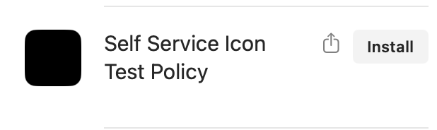
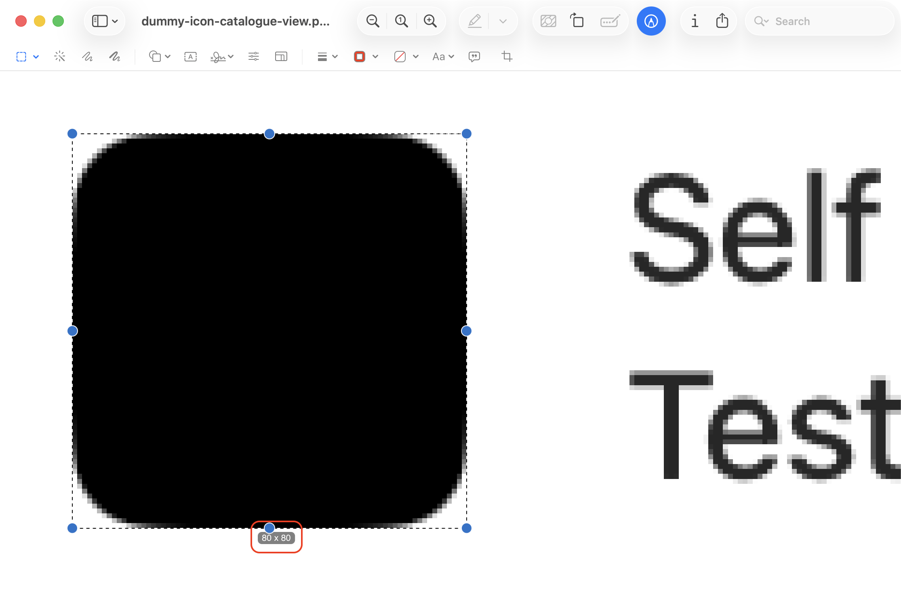
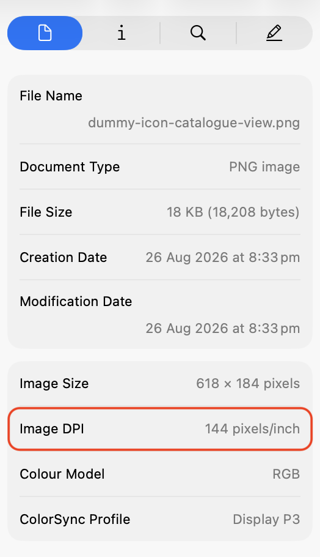

# Submit a MDM self service icon preview size

It’s best to do this in a dev/test environment. If your dev environment also happens to be your prod environment then try and keep this scoped to only your machine or a test device.

1. Create a dummy item or duplicate an existing item in your MDM’s self service application where you can change the icon.
2. Change the icon to an image with edge to edge colour. Don’t use an app icon with transparent padding. There are images you can download from the repo made for this [here](../extras/dummy-images).
3. Open your MDM's self service application and take a screenshot of the item (cmd+shift+4). You don't have to get the edges perfectly. If icons are displayed at different sizes across the app then capture them all and repeat steps 4-6.

 

4. Open the image in Preview and drag the selection marquee around the image to the exact edges. You may need to zoom right in.
Take note of the size dimensions. 

 

5. With the screenshot still open in Preview, open the inspector (cmd+i) and take note of the Image DPI. 

 

6. Either open an issue or post in the `#mica` channel on the Mac Admins Slack with the following information.
    - MDM vendor
    - Self service application name 
    - The section where the icon is displayed. If there's only one size then specify "All".
    - Size dimensions of the icon
    - Image DPI

Examples:

| MDM  | Self service app | Section      | Size | DPI |
|------|------------------|--------------|------|-----|
| Jamf | Self Service+    | Catalog View | 80   | 72  |
| Iru  | Self Service     | All          | 164  | 144 |

