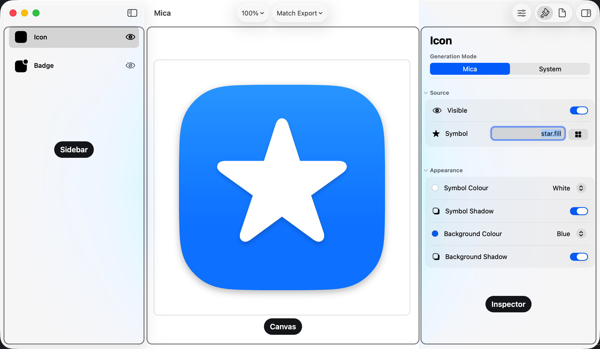
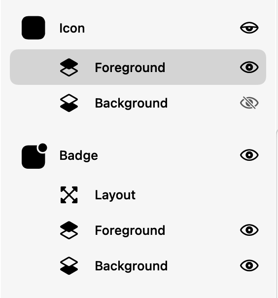
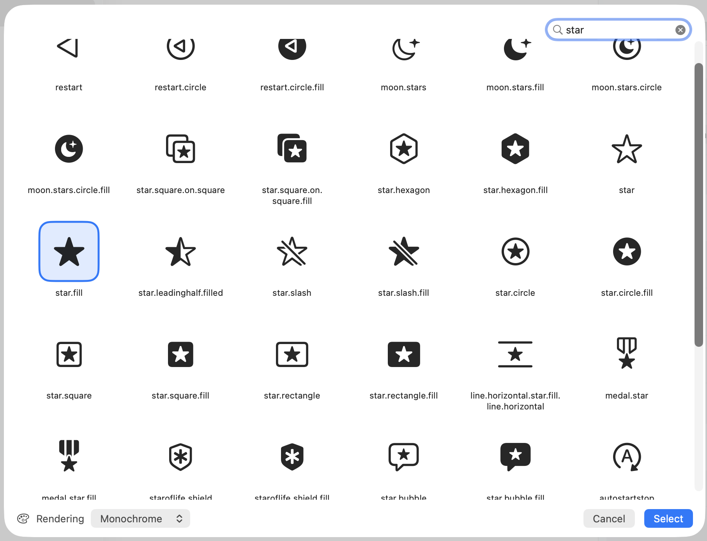

# The Mica Window
The Mica window has three panes for selecting, viewing, and changing an icon.

## Panes
| Pane | Purpose |
|---|---|
| Sidebar | Selects the Icon or Badge group and its layers. |
| Canvas | Shows the current icon and accepts direct actions. |
| Inspector | Changes the selected group or layer. |

Use **View ▸ Show Sidebar** or **⌃⌘S** to show the sidebar.
Use **View ▸ Show Inspector** or **⌃⌘I** to show the inspector.

## Sidebar
The sidebar contains the Icon and Badge groups.
Advanced controls add Foreground and Background rows.
The Badge group also has a Layout row.

Select a row to show its controls.
Each eye shows or hides that layer.
A mixed group eye means one layer is hidden.
The Layout row has no eye because it is not a layer.

The icon background is hidden here, so the Icon eye is mixed.

## Toolbar
| Control | Purpose |
|---|---|
| Zoom | Changes the canvas zoom. |
| Preview Size | Shows the icon at a chosen point size. |
| Sliders button | Shows or hides advanced controls. |
| Controls and Export | Selects the inspector tab. |
| Inspector button | Shows or hides the inspector. |

Preview size and zoom do not change the exported PNG.

## Symbol browser
Click the grid button beside a Symbol field to open the symbol browser.
Type in Search to filter the grid.
Use the Rendering menu to change how the grid draws each symbol.
This changes the grid only.
It does not change your icon.
Use the arrow keys to move the highlight.
Press Return to select the highlighted symbol.
Press Escape with an empty search to close the browser.

## Canvas actions
| Action | Result |
|---|---|
| Click a visible layer | Selects that layer. |
| Drag the badge | Changes its offset. |
| Press an arrow key | Nudges the badge by one percent. |
| Drop an image on the icon | Imports the icon background. |
| Drop an image on the badge | Imports the badge background. |
| Right-click | Opens copy, export, paste, remove, and reset actions. |
| Drag the icon out | Exports a PNG to the drop target. |

System mode does not accept image drops for that group.

## Keyboard shortcuts
| Shortcut | Action |
|---|---|
| ⇧⌘E | Export as PNG |
| ⌘S | Export Configuration |
| ⌘O | Import Configuration |
| ⇧⌘C | Copy Icon |
| ⌘C | Copy the focused canvas icon or selected text |
| ⌘V | Paste an image as the icon background |
| ⌃⌘S | Show or hide the sidebar |
| ⌃⌘I | Show or hide the inspector |
| ⌘+ / ⌘− / ⌘0 | Zoom in, zoom out, or use actual size |
| ⌘, | Open Settings |

The four **Paste as** and four **Import as** commands have no shortcuts.
